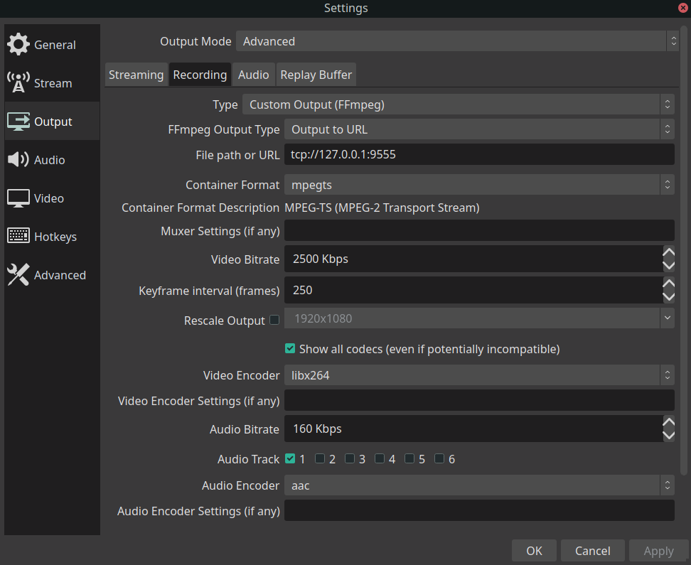

# hls-streamer

Build and run ./hls-streamer without parameters.
The http server with the player starts, as well as the TCP server for receiving the stream from OBS Studio.

OBS Studio is configured like this:

## Usage

1. Build and run
2. Run OBS Studio with settings above
4. Push on "Start Recording" (not streaming!) in OBS Studio
5. Open browser at http://localhost:9099
6. See translation from OBS Studio with time delay about 6-10 second

## Architecture 

- OBS Studio -> hls-streamer with one-input access TCP stream from OBS Studio, or system stdin pipe (see --help),
- hls-streamer -> m3u8 and HLS chunks at file system, 
- http server sharing m3u8 and HLS chunks (http.FileServer), 
- index page with video.js, that render streaming. 
